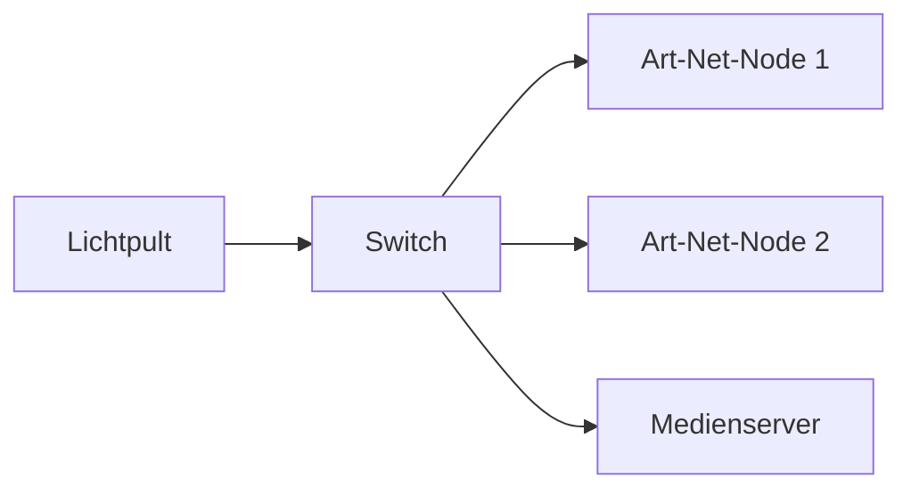
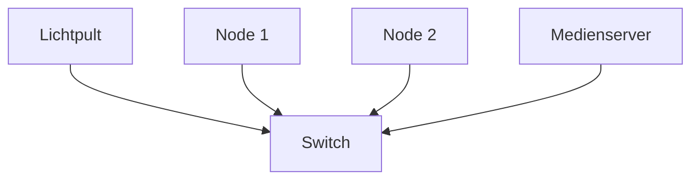
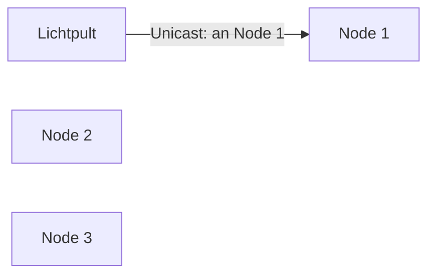
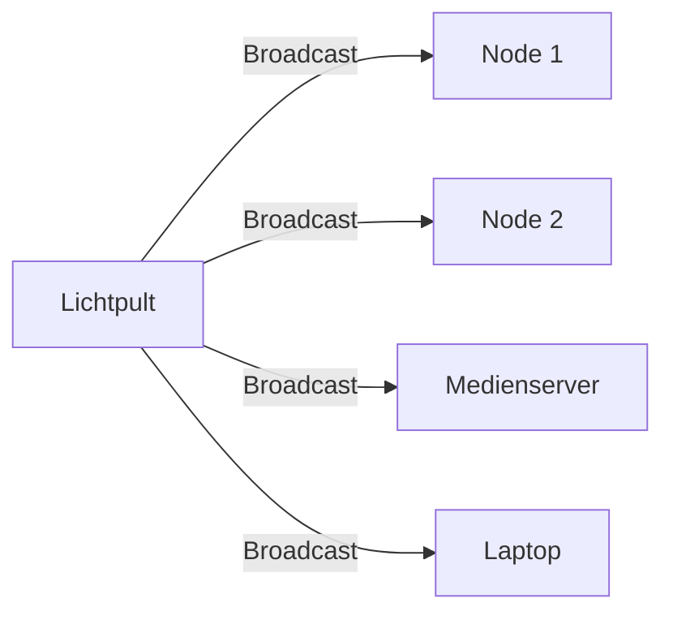
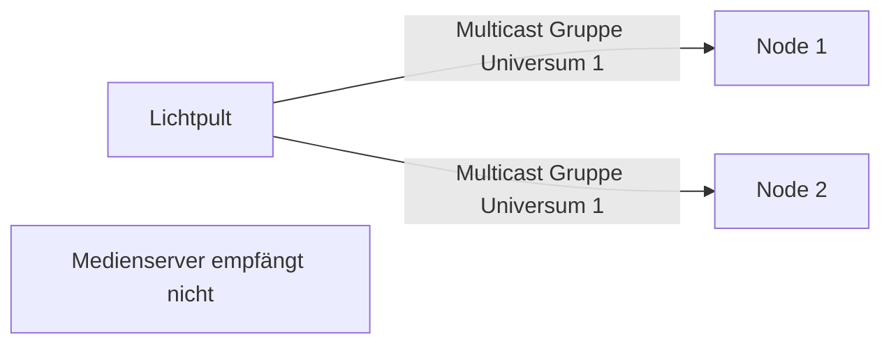
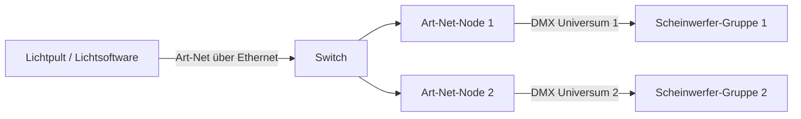
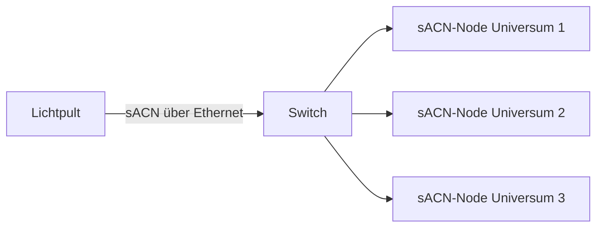
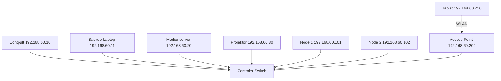
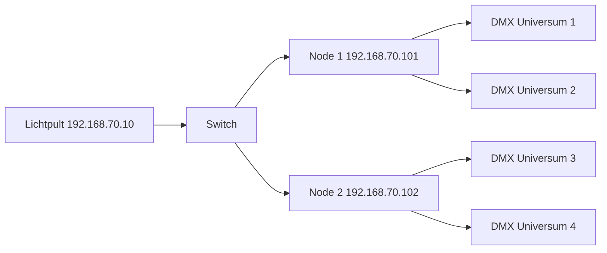

# Netzwerktechnik in der Veranstaltungstechnik  
## Handout für Fachkräfte für Veranstaltungstechnik – prüfungsnah, praxisorientiert und ausführlich

**Zielgruppe:** Auszubildende Fachkraft für Veranstaltungstechnik, besonders zur Vorbereitung auf Klassenarbeiten, praktische Projekte und die Abschlussprüfung.  
**Schwerpunkt:** Netzwerktechnik im Kontext von Licht-, Medien-, Kommunikations- und Steuerungstechnik.  
**Hinweis:** Die Aufgaben in diesem Dokument sind **eigene Übungsaufgaben** und keine Originalprüfungsaufgaben.

---

## Inhaltsverzeichnis

1. [Warum Netzwerktechnik in der Veranstaltungstechnik wichtig ist](#1-warum-netzwerktechnik-in-der-veranstaltungstechnik-wichtig-ist)  
2. [Prüfungsbezug: Wo taucht Netzwerktechnik auf?](#2-prüfungsbezug-wo-taucht-netzwerktechnik-auf)  
3. [Grundbegriffe: Signal, Protokoll, Netzwerk, Teilnehmer](#3-grundbegriffe-signal-protokoll-netzwerk-teilnehmer)  
4. [DMX512 als Ausgangspunkt](#4-dmx512-als-ausgangspunkt)  
5. [Ethernet in der Veranstaltungstechnik](#5-ethernet-in-der-veranstaltungstechnik)  
6. [IP-Adressen, Subnetzmasken und Netzwerkbereiche](#6-ip-adressen-subnetzmasken-und-netzwerkbereiche)  
7. [Switch, Router, Access Point und Node](#7-switch-router-access-point-und-node)  
8. [Unicast, Broadcast und Multicast](#8-unicast-broadcast-und-multicast)  
9. [Art-Net](#9-art-net)  
10. [sACN / Streaming ACN / ANSI E1.31](#10-sacn--streaming-acn--ansi-e131)  
11. [Netzwerkplanung für eine kleine Veranstaltung](#11-netzwerkplanung-für-eine-kleine-veranstaltung)  
12. [Typische Fehler und systematische Fehlersuche](#12-typische-fehler-und-systematische-fehlersuche)  
13. [Erweiterungsthemen: VLAN, QoS, STP, IGMP Snooping, PoE](#13-erweiterungsthemen-vlan-qos-stp-igmp-snooping-poe)  
14. [Prüfungsnahe Übungsaufgaben](#14-prüfungsnahe-übungsaufgaben)  
15. [Lösungshinweise](#15-lösungshinweise)  
16. [Spickzettel / Zusammenfassung](#16-spickzettel--zusammenfassung)  
17. [Glossar](#17-glossar)  
18. [Quellen und weiterführende Links](#18-quellen-und-weiterführende-links)

---

## 1. Warum Netzwerktechnik in der Veranstaltungstechnik wichtig ist

Moderne Veranstaltungstechnik arbeitet nicht mehr nur mit einzelnen Kabeln von Gerät zu Gerät. Viele Systeme werden über **Netzwerke** gesteuert, überwacht oder miteinander verbunden.

Typische Beispiele:

- Lichtpult steuert mehrere Art-Net- oder sACN-Nodes.
- Medienserver sendet Inhalte oder Steuerdaten an Zuspieler und Displays.
- Digitale Audiotechnik nutzt Netzwerke, zum Beispiel für Mehrkanal-Audio oder Steuerung.
- Intercom-, Ruf- und Kommunikationsanlagen werden über IP-Netzwerke eingebunden.
- Projektoren, Kameras, Matrixsysteme, LED-Controller und Medienserver benötigen Netzwerkadressen.
- Monitoring-Software prüft, ob Geräte erreichbar sind und ob Daten gesendet werden.

### Warum ist das prüfungsrelevant?

Eine Fachkraft für Veranstaltungstechnik soll nicht nur Geräte aufbauen, sondern auch **vernetzen, einrichten, in Betrieb nehmen, testen und Fehler erkennen**. Genau hier beginnt Netzwerktechnik.

In Prüfungen wird selten reine IT-Theorie abgefragt. Häufiger geht es um Situationen wie:

> Ein Lichtpult soll über einen Switch zwei Art-Net-Nodes ansteuern. Ein Node reagiert nicht. Prüfen Sie mögliche Ursachen und schlagen Sie Maßnahmen vor.

Oder:

> Legen Sie geeignete IP-Adressen für Lichtpult, Medienserver und Netzwerk-Nodes fest.

Oder:

> Erklären Sie den Unterschied zwischen DMX, Art-Net und sACN.

---

## 2. Prüfungsbezug: Wo taucht Netzwerktechnik auf?

Netzwerktechnik gehört besonders zum Bereich:

> **Vernetzen, Einrichten und Inbetriebnehmen von Anlagen**

und in der Abschlussprüfung besonders zum Prüfungsbereich:

> **Planen der Veranstaltungstechnik**

Dort kann erwartet werden, dass man den **Aufbau, die Vernetzung und die Konfiguration von Systemen der Veranstaltungstechnik** darstellen kann.

### Sehr prüfungsnahe Inhalte

| Thema | Prüfungsnähe | Typische Anforderung |
|---|---:|---|
| DMX, Art-Net, Ethernet, ACN/sACN unterscheiden | sehr hoch | Protokolle erklären und passend auswählen |
| IP-Adresse und Subnetzmaske | sehr hoch | Geräte in dasselbe Netzwerk bringen |
| Switch, Router, Access Point | sehr hoch | Netzwerkinfrastruktur auswählen |
| Unicast, Broadcast, Multicast | hoch | Datenübertragung erklären |
| Fehlersuche im Netzwerk | sehr hoch | systematisch prüfen und Maßnahmen nennen |
| Netzwerkplan lesen/ergänzen | sehr hoch | Topologie darstellen |
| VLAN, QoS, IGMP Snooping | mittel bis Erweiterung | bei größeren Setups oder Spezialthemen |
| STP, LAG, Redundanz | Erweiterung | vor allem bei professionellen Netzwerken |

---

## 3. Grundbegriffe: Signal, Protokoll, Netzwerk, Teilnehmer

### 3.1 Was ist ein Signal?

Ein **Signal** ist eine physikalische oder elektrische Darstellung von Information.

Beispiele:

- Spannung auf einer DMX-Leitung
- Lichtimpulse in Glasfaser
- Funkwellen im WLAN
- elektrische Signale auf einem Netzwerkkabel

### 3.2 Was ist ein Protokoll?

Ein **Protokoll** ist eine Vereinbarung darüber, wie Daten aufgebaut, gesendet, empfangen und interpretiert werden.

Ein einfacher Vergleich:

> Zwei Menschen können nur sinnvoll miteinander sprechen, wenn sie eine gemeinsame Sprache und Regeln nutzen.  
> Bei Geräten übernimmt diese Rolle das Protokoll.

Beispiele aus der Veranstaltungstechnik:

| Protokoll | Zweck |
|---|---|
| DMX512 | Steuerung von Lichttechnik über eine serielle Leitung |
| RDM | Rückkanal/Kommunikation mit Geräten über DMX-Leitungen |
| Art-Net | DMX-Daten über IP/Ethernet |
| sACN / E1.31 | DMX-Daten über IP/Ethernet, häufig multicastbasiert |
| TCP/IP | Grundlegende Protokollfamilie für IP-Netzwerke |
| DHCP | automatische IP-Adressvergabe |
| ICMP | Diagnose, zum Beispiel `ping` |

### 3.3 Was ist ein Netzwerk?

Ein **Netzwerk** verbindet mehrere Geräte, damit sie Daten austauschen können.

In der Veranstaltungstechnik können Netzwerkteilnehmer sein:

- Lichtpult
- Laptop mit Lichtsoftware
- Art-Net-Node
- sACN-Node
- Medienserver
- Projektor
- LED-Wand-Controller
- Netzwerk-Switch
- Access Point
- Intercom-Basisstation
- digitale Stagebox
- Audiomischpult

### 3.4 Was ist ein Netzwerkgerät?

Ein Netzwerkgerät ist ein Gerät, das Daten im Netzwerk sendet, empfängt, weiterleitet oder verwaltet.

Beispiele:

| Gerät | Aufgabe |
|---|---|
| Switch | verbindet Geräte innerhalb eines lokalen Netzwerks |
| Router | verbindet verschiedene Netzwerke miteinander |
| Access Point | bindet WLAN-Geräte in ein Netzwerk ein |
| Node | übersetzt zwischen Netzwerkprotokoll und DMX |
| Medienserver | liefert oder verarbeitet Medien- und Steuerdaten |
| Controller | sendet Steuerdaten, z. B. Lichtpult |

---

## 4. DMX512 als Ausgangspunkt

DMX512 ist ein grundlegendes Protokoll der Lichttechnik. Es ist wichtig, DMX zu verstehen, weil Art-Net und sACN im Kern häufig **DMX-Daten über ein IP-Netzwerk transportieren**.

### 4.1 Grundidee von DMX512

DMX512 überträgt Steuerwerte für Lichtgeräte.

Ein DMX-Universum besitzt:

- bis zu **512 Kanäle**
- pro Kanal einen Wert von **0 bis 255**
- typischerweise eine Datenrichtung: vom Controller zu den Geräten

Beispiel:

| Kanal | Bedeutung bei einem einfachen RGB-Scheinwerfer |
|---:|---|
| 1 | Dimmer |
| 2 | Rot |
| 3 | Grün |
| 4 | Blau |
| 5 | Strobe |

Wenn ein Gerät 5 DMX-Kanäle benötigt und bei Adresse 1 startet, nutzt es die Kanäle 1 bis 5. Das nächste Gerät darf dann nicht ebenfalls auf diesen Kanälen liegen, wenn es unabhängig gesteuert werden soll.

### 4.2 DMX-Adresse

Die **DMX-Adresse** ist die Startadresse eines Geräts im Universum.

Beispiel:

Ein Moving Light benötigt 16 Kanäle.

| Gerät | Startadresse | belegte Kanäle |
|---|---:|---|
| Moving Light 1 | 1 | 1–16 |
| Moving Light 2 | 17 | 17–32 |
| Moving Light 3 | 33 | 33–48 |

### 4.3 DMX-Universum

Ein **Universum** ist ein vollständiger DMX-Datenstrom mit bis zu 512 Kanälen.

Wenn mehr als 512 Kanäle benötigt werden, braucht man weitere Universen.

Beispiel:

- Universum 1: Frontlicht und Washlights
- Universum 2: Moving Lights
- Universum 3: LED-Bars
- Universum 4: Pixel-Mapping

### 4.4 Grenzen von DMX

DMX ist zuverlässig und einfach, hat aber Grenzen:

- nur 512 Kanäle pro Universum
- meist sternförmige Verteilung nur über Splitter sinnvoll
- klassische DMX-Linie ist kein IP-Netzwerk
- Fehlersuche ist oft physikalisch: Kabel, Terminierung, Adresse, Modus
- keine automatische IP-Adressierung, weil DMX keine IP-Adressen nutzt

### 4.5 Typische DMX-Fehler

| Fehler | Mögliche Ursache |
|---|---|
| Gerät reagiert gar nicht | falsche Adresse, falscher Modus, kein Signal, defektes Kabel |
| Geräte flackern | fehlende Terminierung, schlechtes Kabel, Störung |
| falsche Farbe / falsche Bewegung | falscher Fixture-Modus oder Patch |
| mehrere Geräte reagieren gleich | gleiche DMX-Adresse, gewollt oder versehentlich |
| nur Teil der Kette funktioniert | Kabelbruch, defektes Gerät, falsche Verbindung |

---

## 5. Ethernet in der Veranstaltungstechnik

### 5.1 Was ist Ethernet?

**Ethernet** ist eine weit verbreitete Technik, um Geräte in lokalen Netzwerken zu verbinden. In der Veranstaltungstechnik wird Ethernet häufig als Grundlage für Steuer- und Mediendaten verwendet.

Typische Übertragungsmedien:

- Kupferkabel mit RJ45-Steckern, z. B. Cat5e, Cat6, Cat7
- Glasfaserleitungen
- Netzwerkstrecken über Medienkonverter
- in manchen Fällen WLAN, wobei WLAN für kritische Steuerdaten vorsichtig zu bewerten ist

### 5.2 Ethernet ist nicht automatisch Internet

Viele verwechseln „Netzwerk“ mit „Internet“. Das ist falsch.

Ein lokales Veranstaltungsnetzwerk kann vollständig ohne Internet funktionieren.

Beispiel:



Dieses Netzwerk braucht keinen Internetanschluss. Es reicht, wenn alle Geräte korrekt verbunden und passend adressiert sind.

### 5.3 Warum Ethernet statt vieler DMX-Leitungen?

Ethernet wird eingesetzt, weil es:

- viele Universen über eine Leitung transportieren kann
- große Setups übersichtlicher macht
- zentrale Verteilung über Switches ermöglicht
- längere Strecken über Glasfaser erlaubt
- Monitoring und Konfiguration erleichtert
- mehrere Protokolle parallel transportieren kann

Aber:

> Ethernet macht ein Setup nicht automatisch einfacher.  
> Man tauscht DMX-Probleme gegen Netzwerkprobleme.

---

## 6. IP-Adressen, Subnetzmasken und Netzwerkbereiche

### 6.1 Was ist eine IP-Adresse?

Eine IP-Adresse ist die Adresse eines Geräts in einem IP-Netzwerk.

Beispiel:

```text
192.168.10.25
```

Eine IPv4-Adresse besteht aus vier Zahlen zwischen 0 und 255, getrennt durch Punkte.

```text
A.B.C.D
```

Beispiel:

```text
192.168.10.25
A   B   C  D
```

### 6.2 Warum brauchen Geräte IP-Adressen?

Damit Daten gezielt zugestellt werden können.

Ein Vergleich:

- Netzwerk = Stadt
- IP-Adresse = Hausadresse
- Port = Wohnung / Tür / Dienst im Haus

Wenn ein Lichtpult Daten an einen Node senden soll, muss der Node im Netzwerk eindeutig erreichbar sein.

### 6.3 Was ist eine Subnetzmaske?

Die Subnetzmaske legt fest, welcher Teil der IP-Adresse das **Netzwerk** beschreibt und welcher Teil das **Gerät** beschreibt.

Beispiel:

```text
IP-Adresse:     192.168.10.25
Subnetzmaske:   255.255.255.0
```

Bei `255.255.255.0` sind die ersten drei Zahlen das Netzwerk:

```text
Netzwerk:       192.168.10
Gerät/Host:     25
```

Alle Geräte mit `192.168.10.x` und derselben Subnetzmaske befinden sich im selben lokalen Netzwerk.

### 6.4 CIDR-Schreibweise

Statt `255.255.255.0` schreibt man oft `/24`.

| Subnetzmaske | CIDR | Einfach erklärt |
|---|---:|---|
| 255.0.0.0 | /8 | erste Zahl ist Netzwerk |
| 255.255.0.0 | /16 | erste zwei Zahlen sind Netzwerk |
| 255.255.255.0 | /24 | erste drei Zahlen sind Netzwerk |

### 6.5 Beispiel: Sind die Geräte im selben Netzwerk?

#### Beispiel 1

```text
Lichtpult:      192.168.10.10 /24
Art-Net-Node:   192.168.10.50 /24
```

Beide liegen im Netzwerk `192.168.10.0/24`.  
Sie können direkt miteinander kommunizieren.

#### Beispiel 2

```text
Lichtpult:      192.168.10.10 /24
Art-Net-Node:   192.168.11.50 /24
```

Das Lichtpult liegt im Netzwerk `192.168.10.0/24`.  
Der Node liegt im Netzwerk `192.168.11.0/24`.  
Sie sind nicht im selben lokalen Netzwerk.

Ohne Router oder Anpassung der Adressen erreichen sie sich nicht direkt.

### 6.6 Netzwerkadresse und Broadcastadresse

In einem `/24`-Netz sind zwei Adressen besonders:

```text
Netzwerk:        192.168.10.0
Broadcast:       192.168.10.255
Nutzbare Hosts:  192.168.10.1 bis 192.168.10.254
```

Die Netzwerkadresse und Broadcastadresse dürfen nicht als normale Geräteadresse verwendet werden.

### 6.7 Private IP-Bereiche

In lokalen Netzwerken verwendet man meist private IP-Adressen.

| Bereich | Typische Verwendung |
|---|---|
| 10.0.0.0 bis 10.255.255.255 | große private Netze, auch Art-Net-Umgebungen |
| 172.16.0.0 bis 172.31.255.255 | private Netze |
| 192.168.0.0 bis 192.168.255.255 | Heim- und kleine lokale Netze |

### 6.8 Statische IP oder DHCP?

#### Statische IP

Eine Adresse wird fest am Gerät eingestellt.

Vorteile:

- vorhersehbar
- gut für Lichtpulte, Nodes, Medienserver
- unabhängig von einem DHCP-Server

Nachteile:

- Fehler durch doppelte IP-Adressen möglich
- Dokumentation nötig

#### DHCP

Ein DHCP-Server vergibt automatisch IP-Adressen.

Vorteile:

- bequem
- sinnvoll bei vielen wechselnden Geräten
- weniger manuelle Konfiguration

Nachteile:

- DHCP-Server muss vorhanden sein
- Geräte können andere Adressen bekommen
- ungünstig, wenn Steuergeräte feste Zieladressen erwarten

### 6.9 Empfehlung für kleine Prüfungs- und Unterrichtsaufbauten

Für ein kleines Lichtnetzwerk:

```text
Netz:            192.168.50.0/24
Subnetzmaske:    255.255.255.0

Lichtpult:       192.168.50.10
Laptop:          192.168.50.20
Art-Net-Node 1:  192.168.50.101
Art-Net-Node 2:  192.168.50.102
Medienserver:    192.168.50.30
```

Wichtig:

- keine Adresse doppelt vergeben
- alle Geräte in dasselbe Netz
- IP-Adressen dokumentieren
- bei mehreren Netzwerken klare Bereiche verwenden

---

## 7. Switch, Router, Access Point und Node

### 7.1 Switch

Ein **Switch** verbindet Geräte innerhalb eines lokalen Netzwerks.

Beispiel:



Ein Switch merkt sich, an welchem Port welches Gerät angeschlossen ist. Er leitet Daten zielgerichtet weiter.

### 7.2 Unmanaged Switch

Ein unmanaged Switch ist einfach:

- einstecken
- funktioniert ohne Konfiguration
- gut für kleine, einfache Setups

Nachteile:

- keine VLANs
- keine Diagnose
- keine Priorisierung
- wenig Kontrolle bei Problemen

### 7.3 Managed Switch

Ein managed Switch kann konfiguriert werden.

Mögliche Funktionen:

- VLANs
- IGMP Snooping
- QoS
- Port-Statistiken
- Link-Aggregation
- STP/RSTP
- Port-Sperren
- Monitoring

Für Prüfungen im Grundniveau reicht oft:

> Ein managed Switch ist sinnvoll, wenn Netzwerke getrennt, überwacht oder gezielt konfiguriert werden sollen.

### 7.4 Router

Ein **Router** verbindet verschiedene Netzwerke miteinander.

Beispiel:


Ein Router wird benötigt, wenn:

- Geräte aus verschiedenen IP-Netzen miteinander sprechen sollen
- Internetzugang bereitgestellt werden soll
- Daten zwischen VLANs übertragen werden sollen
- Routing-Regeln oder Firewall-Regeln gebraucht werden

Für ein einfaches Lichtnetzwerk ohne Internet ist ein Router oft nicht nötig.

### 7.5 Access Point

Ein **Access Point** bindet WLAN-Geräte in ein Netzwerk ein.

Beispiele:

- Tablet zur Lichtsteuerung
- Laptop zur Fernbedienung
- Drahtlose Konfiguration von Geräten

Wichtig:

WLAN ist störanfälliger als Kabel. Für kritische Steuerdaten sollte man kabelgebundene Verbindungen bevorzugen, wenn möglich.

### 7.6 Node

Ein **Node** ist in der Lichttechnik oft ein Übersetzer zwischen Netzwerk und DMX.

Beispiel:


Ein Node kann:

- Art-Net in DMX ausgeben
- sACN in DMX ausgeben
- manchmal DMX empfangen und ins Netzwerk senden
- mehrere DMX-Universen bereitstellen

Typische Einstellungen am Node:

- IP-Adresse
- Subnetzmaske
- Protokoll: Art-Net oder sACN
- Universum
- DMX-Port-Zuordnung
- Merge-Modus
- ggf. DHCP/statisch

---

## 8. Unicast, Broadcast und Multicast

Diese drei Begriffe beschreiben, **an wen** Daten gesendet werden.

### 8.1 Unicast

**Unicast** bedeutet: Ein Sender sendet gezielt an einen Empfänger.



Merkmale:

- zielgerichtet
- effizient
- Empfänger muss bekannt sein
- IP-Adresse des Zielgeräts ist wichtig

Beispiel:

Ein Lichtpult sendet Art-Net-Daten nur an die IP-Adresse eines bestimmten Nodes.

### 8.2 Broadcast

**Broadcast** bedeutet: Ein Sender sendet an alle Geräte im lokalen Netzwerk.



Merkmale:

- alle Geräte im Netz erhalten die Daten
- einfach zu konfigurieren
- kann unnötige Netzlast erzeugen
- bei großen Setups problematisch

Beispiel:

Art-Net wird in kleinen Setups häufig per Broadcast gesendet.

### 8.3 Multicast

**Multicast** bedeutet: Daten gehen an eine Gruppe von Empfängern, die diese Daten abonnieren.



Merkmale:

- effizienter als Broadcast
- besonders relevant bei sACN
- Switches sollten Multicast sinnvoll behandeln
- bei größeren Netzen kann IGMP Snooping wichtig werden

### 8.4 Vergleich

| Übertragungsart | Deutsch | Beispiel | Vorteil | Nachteil |
|---|---|---|---|---|
| Unicast | einer zu einem | Pult an Node-IP | zielgerichtet | Empfänger muss bekannt sein |
| Broadcast | einer an alle | Art-Net an alle im Netz | einfach | belastet alle Geräte |
| Multicast | einer an Gruppe | sACN-Universum | effizient für Gruppen | Konfiguration/IGMP kann nötig sein |

---

## 9. Art-Net

### 9.1 Was ist Art-Net?

Art-Net ist ein Protokoll, um DMX-Daten über ein IP-/Ethernet-Netzwerk zu übertragen.

Praktisch bedeutet das:

> Ein Lichtpult kann DMX-Universen über ein Netzwerkkabel an Art-Net-Nodes senden.  
> Die Nodes geben daraus wieder klassische DMX-Signale aus.

### 9.2 Typischer Aufbau



### 9.3 Wichtige Art-Net-Begriffe

| Begriff | Bedeutung |
|---|---|
| Controller | sendet Art-Net-Daten, z. B. Lichtpult |
| Node | empfängt Art-Net und gibt DMX aus |
| Universe | DMX-Universum |
| Port | physischer oder logischer Ausgang am Node |
| Net/Sub-Net/Universe | Art-Net-interne Adressierung von Universen |
| IP-Adresse | Netzwerkadresse eines Geräts |

### 9.4 Achtung: Sub-Net ≠ Subnetzmaske

Das ist eine häufige Fehlerquelle.

| Begriff | Gehört zu | Bedeutung |
|---|---|---|
| Subnetzmaske | IP-Netzwerk | legt Netzwerk- und Hostanteil der IP-Adresse fest |
| Sub-Net / Subnet bei Art-Net | Art-Net-Adressierung | Teil der Art-Net-Universumsadressierung |

Diese Begriffe klingen ähnlich, meinen aber nicht dasselbe.

### 9.5 Art-Net und IP-Adressen

Art-Net-Geräte nutzen häufig Adressbereiche wie:

```text
2.x.x.x / 255.0.0.0
10.x.x.x / 255.0.0.0
```

Viele Geräte können aber auch auf andere private IP-Bereiche umgestellt werden.

Wichtig ist:

- Controller und Node müssen sich im selben Netzwerk befinden oder geroutet werden.
- Jedes Gerät braucht eine eindeutige IP-Adresse.
- Subnetzmaske muss passen.
- Kein Gerät darf die gleiche IP-Adresse doppelt haben.

### 9.6 Broadcast oder Unicast bei Art-Net?

Art-Net kann broadcast- oder unicastbasiert arbeiten.

#### Broadcast bei Art-Net

Vorteile:

- einfache Einrichtung
- Nodes müssen nicht immer einzeln als Ziel eingetragen werden
- kleine Setups funktionieren schnell

Nachteile:

- alle Geräte bekommen die Daten
- unnötige Last bei vielen Universen
- ungeeignet für große Netzwerke

#### Unicast bei Art-Net

Vorteile:

- Daten gehen gezielt an bestimmte Nodes
- weniger Netzlast
- besser für größere Setups

Nachteile:

- IP-Adressen und Zielgeräte müssen korrekt konfiguriert werden
- Fehlkonfiguration führt schnell zu Ausfällen

### 9.7 Prüfungsnahe Aussage zu Art-Net

Eine gute Antwort in der Prüfung könnte lauten:

> Art-Net überträgt DMX-Daten über ein IP-basiertes Ethernet-Netzwerk. Im Gegensatz zu klassischem DMX benötigt jedes Netzwerkgerät eine passende IP-Adresse und Subnetzmaske. Art-Net kann in kleinen Setups per Broadcast arbeiten; bei größeren Setups ist Unicast oft sinnvoller, weil dadurch nur die benötigten Empfänger Daten erhalten.

---

## 10. sACN / Streaming ACN / ANSI E1.31

### 10.1 Was ist sACN?

sACN steht für **Streaming ACN** und ist als **ANSI E1.31** standardisiert.

sACN überträgt DMX512-Daten über IP-Netzwerke. Es wird in professionellen Lichtnetzwerken häufig eingesetzt.

### 10.2 Grundidee



### 10.3 sACN und Multicast

sACN wird häufig mit Multicast genutzt.

Das bedeutet:

- jedes Universum kann einer Multicast-Gruppe entsprechen
- Empfänger abonnieren die Gruppen, die sie benötigen
- nicht jedes Gerät muss jeden Datenstrom verarbeiten

### 10.4 sACN-Port

sACN verwendet üblicherweise UDP-Port:

```text
5568
```

### 10.5 Universen bei sACN

sACN-Universen werden typischerweise als Zahlen angegeben.

Beispiel:

| sACN-Universum | Inhalt |
|---:|---|
| 1 | Frontlicht |
| 2 | Wash |
| 3 | Moving Lights |
| 4 | LED-Pixel |
| 5 | Effektgeräte |

### 10.6 Art-Net und sACN im Vergleich

| Merkmal | DMX512 | Art-Net | sACN |
|---|---|---|---|
| Übertragung | DMX-Leitung | Ethernet/IP | Ethernet/IP |
| Typische Daten | DMX-Kanäle | DMX über IP | DMX über IP |
| Adressierung Geräte | DMX-Adresse | IP + Art-Net-Universum | IP + sACN-Universum |
| Übertragungsart | seriell | Broadcast oder Unicast | häufig Multicast, auch Unicast |
| Netzwerk nötig | nein | ja | ja |
| Typische Anwendung | kleine bis mittlere DMX-Linien | Lichtnetzwerke, Nodes | professionelle Lichtnetzwerke |
| Diagnose | Kabel/Adresse/Terminierung | zusätzlich IP/Netzwerk | zusätzlich IP/Multicast/IGMP |

### 10.7 Prüfungsnahe Aussage zu sACN

> sACN ist ein standardisiertes Protokoll zur Übertragung von DMX512-Daten über IP-Netzwerke. Es nutzt häufig Multicast, sodass Daten eines Universums gezielt an interessierte Empfängergruppen verteilt werden können. Dadurch eignet es sich gut für größere und strukturierte Lichtnetzwerke.

---

## 11. Netzwerkplanung für eine kleine Veranstaltung

### 11.1 Ausgangssituation

Eine Schulveranstaltung soll mit folgender Technik betrieben werden:

- 1 Lichtpult
- 1 Laptop mit Lichtsoftware als Backup
- 2 Art-Net/sACN-Nodes mit je 2 DMX-Ausgängen
- 1 Medienserver
- 1 Projektor
- 1 WLAN-Access-Point für ein Tablet zur Fernbedienung
- 1 Switch

### 11.2 Netzwerkziel

Alle relevanten Geräte sollen:

- im selben lokalen Netzwerk erreichbar sein
- eindeutige IP-Adressen haben
- dokumentiert werden
- testbar sein
- logisch benannt werden

### 11.3 IP-Adressplan

Beispielnetz:

```text
Netzwerk:      192.168.60.0/24
Subnetzmaske:  255.255.255.0
Gateway:       nicht zwingend erforderlich, wenn kein Internet/Router genutzt wird
```

| Gerät | IP-Adresse | Bemerkung |
|---|---:|---|
| Lichtpult | 192.168.60.10 | Hauptcontroller |
| Backup-Laptop | 192.168.60.11 | Lichtsoftware |
| Medienserver | 192.168.60.20 | Zuspielung |
| Projektor | 192.168.60.30 | Steuerung/Monitoring |
| Node 1 | 192.168.60.101 | DMX Universum 1 und 2 |
| Node 2 | 192.168.60.102 | DMX Universum 3 und 4 |
| Access Point | 192.168.60.200 | WLAN für Tablet |
| Tablet | 192.168.60.210 | Fernbedienung |

### 11.4 Topologie



### 11.5 Universumsplan

| Universum | Protokoll | Ziel | DMX-Ausgang |
|---:|---|---|---|
| 1 | Art-Net oder sACN | Node 1 | Port A |
| 2 | Art-Net oder sACN | Node 1 | Port B |
| 3 | Art-Net oder sACN | Node 2 | Port A |
| 4 | Art-Net oder sACN | Node 2 | Port B |

### 11.6 Dokumentation

Eine gute Netzwerkdokumentation enthält:

- Gerätebezeichnung
- Standort
- IP-Adresse
- Subnetzmaske
- MAC-Adresse, falls relevant
- Switch-Port
- Protokoll
- Universum
- Verantwortliche Person
- Besonderheiten

Beispiel:

| Gerät | Ort | Switch-Port | IP | Protokoll | Funktion |
|---|---|---:|---:|---|---|
| Node 1 | Bühne links | 5 | 192.168.60.101 | Art-Net | DMX U1/U2 |
| Node 2 | Bühne rechts | 6 | 192.168.60.102 | Art-Net | DMX U3/U4 |
| Medienserver | FOH | 7 | 192.168.60.20 | TCP/IP | Playback |

### 11.7 Gute Praxis

- Techniknetz nicht mit Gast-WLAN mischen.
- Keine unbekannten Geräte in das Lichtnetz stecken.
- Kabel beschriften.
- IP-Adressen vor Beginn dokumentieren.
- Switch-Port-Belegung notieren.
- Konfiguration sichern.
- Ersatzkabel bereithalten.
- Vor Publikum keine Experimente mit Netzwerkänderungen durchführen.

---

## 12. Typische Fehler und systematische Fehlersuche

### 12.1 Grundprinzip der Fehlersuche

Bei Netzwerkproblemen immer von einfach nach komplex prüfen.

Merksatz:

> Erst Physik, dann Adresse, dann Protokoll, dann Anwendung.

### 12.2 Fehlersuche Schritt für Schritt

#### Schritt 1: Stromversorgung prüfen

Fragen:

- Ist das Gerät eingeschaltet?
- Leuchten Status-LEDs?
- Hat der Node Strom?
- Funktioniert PoE, falls verwendet?
- Ist das Netzteil korrekt?

#### Schritt 2: Kabel und Link prüfen

Fragen:

- Ist das Netzwerkkabel eingesteckt?
- Leuchten Link-LEDs am Switch?
- Blinkt Aktivität?
- Ist das Kabel beschädigt?
- Ist es wirklich ein Netzwerkkabel und kein falsches Kabel?
- Ist der richtige Switch-Port verwendet?

#### Schritt 3: IP-Adresse prüfen

Fragen:

- Hat jedes Gerät eine eindeutige IP-Adresse?
- Liegen alle Geräte im gleichen Netzwerk?
- Ist die Subnetzmaske identisch bzw. passend?
- Gibt es doppelte IP-Adressen?
- Hat ein Gerät versehentlich DHCP statt statischer IP?

#### Schritt 4: Erreichbarkeit prüfen

Werkzeuge:

```bash
ping 192.168.60.101
```

Interpretation:

| Ergebnis | Bedeutung |
|---|---|
| Antwort kommt | Gerät ist grundsätzlich erreichbar |
| Zeitüberschreitung | Gerät nicht erreichbar oder blockiert ICMP |
| Zielhost nicht erreichbar | lokales Netzwerkproblem oder falsche Route |
| unregelmäßige Antworten | Kabel, Switch, Last oder Störung möglich |

#### Schritt 5: Protokoll prüfen

Fragen:

- Sendet das Lichtpult wirklich Art-Net oder sACN?
- Ist das richtige Universum gewählt?
- Ist am Node Art-Net oder sACN aktiviert?
- Ist der richtige DMX-Ausgang zugeordnet?
- Ist Broadcast/Unicast/Multicast korrekt eingestellt?
- Bei Unicast: stimmt die Ziel-IP?
- Bei sACN: stimmt Universum und ggf. Priorität?

#### Schritt 6: Anwendung prüfen

Fragen:

- Ist die Showdatei korrekt gepatcht?
- Sind Fixtures richtig adressiert?
- Stimmen DMX-Modus und Patch überein?
- Ist der Output aktiviert?
- Ist ein Blackout aktiv?
- Ist Grand Master auf 0?
- Ist ein Universum deaktiviert?

### 12.3 Typische Fehlerbilder

| Fehlerbild | Mögliche Ursachen | Prüfung |
|---|---|---|
| Node taucht nicht auf | falsche IP, Kabel, Switch, anderes Netz | Link-LED, IP, Ping |
| Node ist pingbar, aber kein Licht | falsches Universum, Output aus, DMX-Problem | Protokoll, Patch, DMX-Kabel |
| Nur ein DMX-Port funktioniert | falsche Port-Zuordnung | Node-Konfiguration |
| Einige Geräte flackern | DMX-Termination, Kabel, Broadcast-Last | DMX-Linie und Netzwerk prüfen |
| Alles funktioniert, bis WLAN dazukommt | AP falsch verbunden, IP-Konflikt, DHCP | Adressplan prüfen |
| sACN funktioniert auf kleinem Switch, aber nicht im großen Netz | Multicast/IGMP/VLAN-Thema | Switch-Konfiguration prüfen |
| Art-Net im Broadcast belastet Netzwerk stark | zu viele Universen im Broadcast | auf Unicast umstellen |

### 12.4 Wichtige Diagnosebefehle

#### Windows

```powershell
ipconfig
ping 192.168.60.101
arp -a
tracert 192.168.60.101
```

#### Linux / macOS

```bash
ip addr
ifconfig
ping 192.168.60.101
arp -a
traceroute 192.168.60.101
```

### 12.5 Was bedeutet `ping`?

`ping` sendet Testpakete an ein Gerät. Antwortet das Gerät, ist es grundsätzlich erreichbar.

Aber:

> Wenn `ping` funktioniert, heißt das noch nicht, dass Art-Net oder sACN korrekt funktioniert.  
> Es zeigt nur, dass eine grundlegende IP-Verbindung besteht.

### 12.6 Was bedeutet `arp -a`?

ARP zeigt bekannte Zuordnungen zwischen IP-Adressen und MAC-Adressen.

Nützlich bei:

- IP-Konflikten
- Prüfung, ob ein Gerät im lokalen Netz sichtbar ist
- Erkennen, ob eine IP-Adresse zu einer anderen MAC-Adresse gewechselt hat

---

## 13. Erweiterungsthemen: VLAN, QoS, STP, IGMP Snooping, PoE

Diese Themen sind nicht immer Kernstoff für einfache Prüfungsfragen, aber für professionelle Netzwerke sehr wichtig.

### 13.1 VLAN

Ein VLAN trennt ein physisches Netzwerk logisch in mehrere getrennte Netzwerke.

Beispiel:

| VLAN | Zweck |
|---:|---|
| 10 | Licht |
| 20 | Audio |
| 30 | Video |
| 40 | Produktion/Büro |
| 50 | Gast-WLAN |

Vorteile:

- Trennung von Datenverkehr
- bessere Übersicht
- mehr Sicherheit
- weniger Störungen zwischen Gewerken

Nachteil:

- Switch muss korrekt konfiguriert sein
- Fehlkonfiguration kann Geräte unerreichbar machen

Prüfungsnahe Aussage:

> Ein VLAN kann Licht-, Audio- und Produktionsnetz logisch trennen, obwohl dieselbe physische Switch-Infrastruktur genutzt wird.

### 13.2 QoS

QoS bedeutet **Quality of Service**.

Damit können bestimmte Daten bevorzugt behandelt werden.

Beispiele:

- Audio-over-IP soll keine Aussetzer haben.
- Steuerdaten sollen stabil übertragen werden.
- unwichtige Daten sollen nicht kritische Echtzeitdaten verdrängen.

Prüfungsnahe Aussage:

> QoS kann helfen, zeitkritische Datenströme im Netzwerk zu priorisieren.

### 13.3 STP / RSTP

STP steht für **Spanning Tree Protocol**.

Es verhindert Netzwerkschleifen.

Eine Schleife entsteht zum Beispiel, wenn zwei Switches mehrfach miteinander verbunden werden, ohne dass das Netzwerk dafür konfiguriert ist.

Problem:


Ohne Schutz können Broadcast-Stürme entstehen.

Prüfungsnahe Aussage:

> STP schützt vor Netzwerkschleifen, kann aber bei falscher Konfiguration auch Ports blockieren.

### 13.4 IGMP Snooping

IGMP Snooping ist wichtig bei Multicast.

Ein Switch mit IGMP Snooping kann erkennen, welche Ports bestimmte Multicast-Daten wirklich benötigen. Dadurch werden Multicast-Daten nicht unnötig an alle Ports verteilt.

Besonders relevant bei:

- sACN
- Audio-over-IP
- Video-over-IP
- großen Netzwerken mit vielen Multicast-Daten

Prüfungsnahe Aussage:

> IGMP Snooping kann Multicast-Verkehr gezielter verteilen und dadurch Netzlast reduzieren.

### 13.5 PoE

PoE bedeutet **Power over Ethernet**.

Dabei werden Daten und Strom über dasselbe Netzwerkkabel übertragen.

Typische Geräte:

- Access Points
- kleine Controller
- IP-Kameras
- Intercom-Geräte
- manche Netzwerkadapter

Wichtig:

- Switch muss PoE unterstützen.
- Leistung muss ausreichen.
- PoE ersetzt nicht jede Stromversorgung.

---

## 14. Prüfungsnahe Übungsaufgaben

### Aufgabe 1: Begriffe zuordnen

Ordnen Sie die Begriffe den passenden Erklärungen zu.

| Begriff | Erklärung |
|---|---|
| DMX | A |
| Art-Net | B |
| sACN | C |
| Switch | D |
| Router | E |
| Subnetzmaske | F |
| Broadcast | G |
| Unicast | H |

Erklärungen:

1. verbindet verschiedene Netzwerke miteinander  
2. sendet Daten an alle Geräte im lokalen Netzwerk  
3. klassische Lichtsteuerung mit bis zu 512 Kanälen pro Universum  
4. legt fest, welcher Teil der IP-Adresse das Netzwerk beschreibt  
5. sendet Daten gezielt an ein bestimmtes Gerät  
6. überträgt DMX-Daten über IP/Ethernet, häufig mit Broadcast oder Unicast  
7. verbindet Geräte innerhalb eines lokalen Netzwerks  
8. standardisiertes DMX-over-IP-Protokoll, häufig mit Multicast  

---

### Aufgabe 2: IP-Adressen prüfen

Gegeben sind folgende Geräte:

| Gerät | IP-Adresse | Subnetzmaske |
|---|---:|---:|
| Lichtpult | 192.168.20.10 | 255.255.255.0 |
| Node 1 | 192.168.20.101 | 255.255.255.0 |
| Node 2 | 192.168.21.102 | 255.255.255.0 |
| Laptop | 192.168.20.50 | 255.255.255.0 |

Fragen:

1. Welche Geräte befinden sich im selben Netzwerk wie das Lichtpult?
2. Welches Gerät ist vermutlich nicht direkt erreichbar?
3. Welche IP-Adresse könnten Sie Node 2 geben, damit er im selben Netzwerk liegt?
4. Warum darf `192.168.20.255` nicht als Geräteadresse verwendet werden?

---

### Aufgabe 3: Netzwerkplan ergänzen

Ein Lichtpult soll zwei Nodes ansteuern. Jeder Node gibt zwei DMX-Universen aus. Ergänzen Sie einen sinnvollen Netzwerk- und Universumsplan.

Vorgaben:

```text
Netzwerk: 192.168.70.0/24
Lichtpult: 192.168.70.10
```

Tragen Sie ein:

| Gerät | IP-Adresse | Universum/Port |
|---|---:|---|
| Node 1 |  |  |
| Node 2 |  |  |

Zeichnen Sie außerdem eine einfache Topologie mit Lichtpult, Switch, Node 1, Node 2 und DMX-Geräten.

---

### Aufgabe 4: Art-Net oder sACN?

Entscheiden Sie, welches Protokoll in den Situationen sinnvoll sein kann. Begründen Sie.

1. Kleiner Aufbau mit einem Lichtpult, einem Switch und einem 4-Port-Node.
2. Großes Setup mit vielen Universen, mehreren Switches und mehreren Empfängergruppen.
3. Ein Node soll gezielt nur die Daten für ein bestimmtes Universum erhalten.
4. Ein professionelles Lichtnetz nutzt Multicast und IGMP Snooping.

---

### Aufgabe 5: Fehlersuche

Ein Art-Net-Node reagiert nicht. Die DMX-Geräte bleiben dunkel.

Gegeben:

- Lichtpult: `192.168.50.10 /24`
- Node: `192.168.51.101 /24`
- Switch-Link-LED leuchtet
- DMX-Kabel ist eingesteckt
- Output am Lichtpult ist aktiviert

Fragen:

1. Was fällt an den IP-Adressen auf?
2. Warum kann das ein Problem sein?
3. Welche zwei Lösungen sind möglich?
4. Welche weiteren Punkte würden Sie prüfen?

---

### Aufgabe 6: Broadcast, Unicast, Multicast erklären

Erklären Sie die Begriffe mit eigenen Worten und nennen Sie jeweils ein Beispiel aus der Veranstaltungstechnik.

| Begriff | Erklärung | Beispiel |
|---|---|---|
| Unicast |  |  |
| Broadcast |  |  |
| Multicast |  |  |

---

### Aufgabe 7: Praxisfall Schulveranstaltung

Für eine Schulveranstaltung sollen folgende Geräte vernetzt werden:

- Lichtpult
- Laptop mit Lichtsoftware
- 2 Art-Net-Nodes
- Medienserver
- Projektor
- WLAN-Access-Point für Tablet
- Switch

Erstellen Sie:

1. einen IP-Adressplan  
2. eine Netzwerk-Topologie  
3. eine kurze Begründung, warum Sie einen Switch benötigen  
4. eine kurze Einschätzung, ob ein Router nötig ist  
5. drei mögliche Fehlerquellen bei der Inbetriebnahme  

---

### Aufgabe 8: Kurzantworten

Beantworten Sie kurz:

1. Warum benötigt ein klassisches DMX-Gerät keine IP-Adresse?
2. Warum benötigt ein Art-Net-Node eine IP-Adresse?
3. Was ist der Unterschied zwischen DMX-Adresse und IP-Adresse?
4. Was bedeutet `/24`?
5. Warum sollte man IP-Adressen dokumentieren?
6. Warum ist Broadcast in großen Setups problematisch?
7. Was kann IGMP Snooping bei sACN verbessern?
8. Warum sollte ein Produktionsnetz nicht mit Gast-WLAN vermischt werden?

---

## 15. Lösungshinweise

> Die Lösungshinweise sind zur Selbstkontrolle gedacht. In einer Prüfung müssen Antworten in eigenen Worten formuliert werden.

### Lösung zu Aufgabe 1

| Begriff | passende Erklärung |
|---|---|
| DMX | 3 |
| Art-Net | 6 |
| sACN | 8 |
| Switch | 7 |
| Router | 1 |
| Subnetzmaske | 4 |
| Broadcast | 2 |
| Unicast | 5 |

### Lösung zu Aufgabe 2

1. Lichtpult, Node 1 und Laptop liegen im Netz `192.168.20.0/24`.
2. Node 2 liegt mit `192.168.21.102/24` in einem anderen Netz.
3. Mögliche Adresse: `192.168.20.102`, sofern frei.
4. `192.168.20.255` ist die Broadcastadresse im `/24`-Netz.

### Lösung zu Aufgabe 3

Möglicher Plan:

| Gerät | IP-Adresse | Universum/Port |
|---|---:|---|
| Node 1 | 192.168.70.101 | Port A = U1, Port B = U2 |
| Node 2 | 192.168.70.102 | Port A = U3, Port B = U4 |

Topologie:



### Lösung zu Aufgabe 4

1. Art-Net Broadcast oder Unicast kann für ein kleines Setup ausreichend sein.
2. sACN mit Multicast kann sinnvoll sein; alternativ Art-Net Unicast bei sauberer Planung.
3. Unicast ist sinnvoll, weil gezielt an einen Empfänger gesendet wird.
4. sACN passt gut, weil es häufig mit Multicast arbeitet.

### Lösung zu Aufgabe 5

1. Lichtpult und Node liegen in unterschiedlichen `/24`-Netzen.
2. `192.168.50.10/24` und `192.168.51.101/24` erreichen sich ohne Router nicht direkt.
3. Entweder Node auf `192.168.50.x/24` ändern oder Routing zwischen den Netzen einrichten.
4. Zusätzlich prüfen: Protokoll aktiv, Universum korrekt, Node-Port-Zuordnung, DMX-Adresse, Fixture-Modus, Blackout, Grand Master, Kabel, Switch-Port.

### Lösung zu Aufgabe 6

| Begriff | Erklärung | Beispiel |
|---|---|---|
| Unicast | Daten gehen an genau einen Empfänger | Art-Net gezielt an Node-IP |
| Broadcast | Daten gehen an alle Geräte im lokalen Netz | Art-Net in kleinem Setup |
| Multicast | Daten gehen an eine Empfängergruppe | sACN-Universum an abonnierende Nodes |

### Lösung zu Aufgabe 7

Möglicher IP-Plan:

| Gerät | IP |
|---|---:|
| Lichtpult | 192.168.60.10 |
| Laptop | 192.168.60.11 |
| Medienserver | 192.168.60.20 |
| Projektor | 192.168.60.30 |
| Node 1 | 192.168.60.101 |
| Node 2 | 192.168.60.102 |
| Access Point | 192.168.60.200 |
| Tablet | 192.168.60.210 |

Ein Switch wird benötigt, um mehrere Geräte im selben lokalen Netzwerk zu verbinden.  
Ein Router ist nur nötig, wenn andere Netzwerke oder Internet angebunden werden sollen.  
Mögliche Fehlerquellen: doppelte IP, falsches Subnetz, falsches Universum, WLAN im falschen Netz, falscher Switch-Port, Output deaktiviert.

### Lösung zu Aufgabe 8

1. DMX nutzt keine IP-Kommunikation, sondern eine serielle Steuerleitung.
2. Ein Art-Net-Node ist Teilnehmer in einem IP-Netzwerk.
3. DMX-Adresse = Startkanal im DMX-Universum; IP-Adresse = Geräteadresse im Netzwerk.
4. `/24` entspricht `255.255.255.0`.
5. Damit Geräte eindeutig erreichbar bleiben und Fehler schneller gefunden werden.
6. Weil alle Geräte unnötig Daten erhalten und die Netzlast steigt.
7. Es verteilt Multicast nur an Ports, die die Daten benötigen.
8. Aus Sicherheits-, Stabilitäts- und Übersichtlichkeitsgründen.

---

## 16. Spickzettel / Zusammenfassung

### Wichtigste Begriffe

| Begriff | Kurzdefinition |
|---|---|
| DMX | Lichtsteuerprotokoll mit bis zu 512 Kanälen pro Universum |
| Universum | ein vollständiger DMX-Datenstrom |
| Ethernet | Technik für lokale Netzwerke |
| IP-Adresse | Adresse eines Geräts im Netzwerk |
| Subnetzmaske | trennt Netzwerk- und Geräteanteil der IP-Adresse |
| Switch | verbindet Geräte im selben Netzwerk |
| Router | verbindet verschiedene Netzwerke |
| Access Point | WLAN-Zugang zum Netzwerk |
| Node | Übersetzer zwischen Netzwerk und DMX |
| Art-Net | DMX über IP/Ethernet |
| sACN | standardisiertes DMX über IP/Ethernet, häufig Multicast |
| Unicast | einer an einen |
| Broadcast | einer an alle |
| Multicast | einer an eine Gruppe |

### Muss ich können

- IP-Adressen und Subnetzmasken lesen.
- Erkennen, ob Geräte im selben Netzwerk liegen.
- DMX, Art-Net und sACN unterscheiden.
- Switch, Router und Access Point unterscheiden.
- Broadcast, Unicast und Multicast erklären.
- Einfache Netzwerkpläne erstellen.
- Einfache Fehlersuche strukturiert beschreiben.
- Universen und Node-Ausgänge sinnvoll zuordnen.

### Merksätze

> DMX-Adresse und IP-Adresse sind nicht dasselbe.

> Ein Switch verbindet Geräte in einem Netzwerk.  
> Ein Router verbindet verschiedene Netzwerke.

> Erst Kabel und Link prüfen, dann IP-Adresse, dann Protokoll, dann Patch.

> Broadcast ist einfach, aber nicht immer effizient.

> Multicast ist nützlich, braucht aber bei größeren Setups saubere Switch-Konfiguration.

> Art-Net-Subnet ist nicht dasselbe wie IP-Subnetzmaske.

---

## 17. Glossar

| Begriff | Erklärung |
|---|---|
| ACN | Architecture for Control Networks; Protokollfamilie für Veranstaltungstechnik |
| APIPA | automatische private IP-Adresse, wenn DHCP fehlschlägt |
| Art-Net | Protokoll zur Übertragung von DMX-Daten über IP-Netzwerke |
| Broadcast | Datenübertragung an alle Geräte im lokalen Netzwerk |
| CIDR | Schreibweise für Subnetzmasken, z. B. `/24` |
| DHCP | automatische Vergabe von IP-Adressen |
| DMX512 | Lichtsteuerprotokoll mit bis zu 512 Kanälen pro Universum |
| DNS | Namensauflösung; in Lichtnetzen oft nicht zentral |
| Gateway | Übergang zu einem anderen Netzwerk |
| Host | Gerät in einem Netzwerk |
| ICMP | Diagnoseprotokoll, z. B. für `ping` |
| IGMP | Protokoll zur Verwaltung von Multicast-Gruppen |
| IGMP Snooping | Switch-Funktion zur gezielten Verteilung von Multicast |
| IP-Adresse | Adresse eines Geräts in einem IP-Netzwerk |
| MAC-Adresse | Hardwareadresse einer Netzwerkschnittstelle |
| Multicast | Datenübertragung an eine Gruppe von Empfängern |
| Node | Gerät, das Netzwerkdaten in DMX umsetzt oder umgekehrt |
| PoE | Power over Ethernet, Stromversorgung über Netzwerkkabel |
| QoS | Quality of Service, Priorisierung von Datenverkehr |
| Router | Gerät zum Verbinden verschiedener Netzwerke |
| sACN | Streaming ACN, standardisiertes DMX-over-IP-Protokoll |
| STP | Spanning Tree Protocol, Schutz vor Netzwerkschleifen |
| Subnetzmaske | legt Netzanteil und Hostanteil einer IP-Adresse fest |
| Switch | Gerät zur Verbindung mehrerer Netzwerkteilnehmer |
| TCP | verbindungsorientiertes Transportprotokoll |
| UDP | verbindungsloses Transportprotokoll, häufig für Streaming/Steuerdaten |
| Unicast | Datenübertragung an genau einen Empfänger |
| VLAN | logisch getrenntes Netzwerk auf gemeinsamer Switch-Infrastruktur |
| WLAN | drahtloses lokales Netzwerk |

---

## 18. Quellen und weiterführende Links

Die folgenden Quellen wurden zur fachlichen Orientierung genutzt. Das Handout ist didaktisch aufbereitet und enthält eigene Beispiele und Übungsaufgaben.

1. **BIBB – Fachkraft für Veranstaltungstechnik. Umsetzungshilfe für die Ausbildungspraxis**  
   https://www.bibb.de/dienst/publikationen/de/8374

2. **Veranstaltungsfachkräfteausbildungsverordnung – Prüfungsbereiche und Ausbildungsrahmenplan**  
   https://www.buzer.de/gesetz/12065/index.htm

3. **IHK Bonn / BIBB-Umsetzungshilfe als PDF – u. a. Vernetzen, Einrichten und Inbetriebnehmen von Anlagen**  
   https://www.ihk-bonn.de/fileadmin/dokumente/Downloads/Ausbildung/Fachkraft_fuer_Veranstaltungstechnik/Umsetzungshilfe_FKVT.pdf

4. **IGVW SQQ10 – Sachkunde für Informations- und Kommunikationstechnik Level 1**  
   https://www.igvw.org/wp-content/uploads/IGVW_SQQ10_DE.pdf

5. **Artistic Licence – Art-Net 4 Specification**  
   https://art-net.org.uk/downloads/art-net.pdf

6. **ESTA / ANSI E1.31 – Lightweight streaming protocol for transport of DMX512 using ACN**  
   https://tsp.esta.org/tsp/documents/docs/E1-31-2016.pdf

7. **ESTA – Recommended Practice for DMX512**  
   https://tsp.esta.org/tsp/documents/docs/DMX512-A_Guide_%288x10%29_ESTA.PDF

8. **QLC+ Dokumentation – E1.31 / sACN Grundlagen**  
   https://docs.qlcplus.org/v4/plugins/e1-31-sacn

9. **MA Lighting dot2 Hilfe – Netzwerkprotokolle Art-Net und sACN**  
   https://help.malighting.com/dot2/de/help/key_window_networkprotocols.html

---

## Lehrkraft-Hinweis

Dieses Material ist absichtlich ausführlich gehalten. Für eine einzelne Unterrichtseinheit kann es in Teile zerlegt werden:

- Teil 1: DMX, Universen, Netzwerkidee  
- Teil 2: IP-Adresse, Subnetzmaske, Switch/Router  
- Teil 3: Art-Net und sACN  
- Teil 4: Fehlersuche und Prüfungsaufgaben  
- Teil 5: Erweiterung mit VLAN, IGMP Snooping, QoS  

Für schwächere Lerngruppen empfiehlt es sich, zuerst nur mit einem `/24`-Netz zu arbeiten und erst später `/16`, `/8`, VLAN oder Multicast-Details einzuführen.
